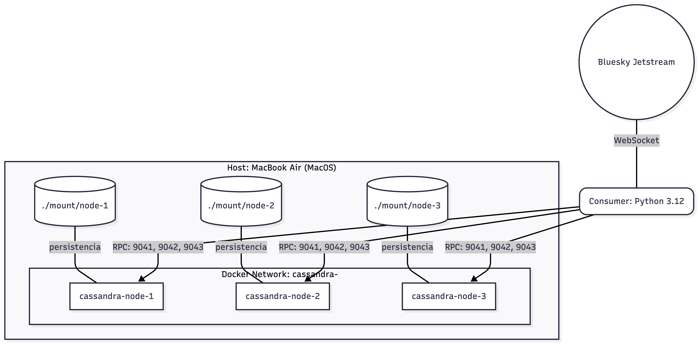
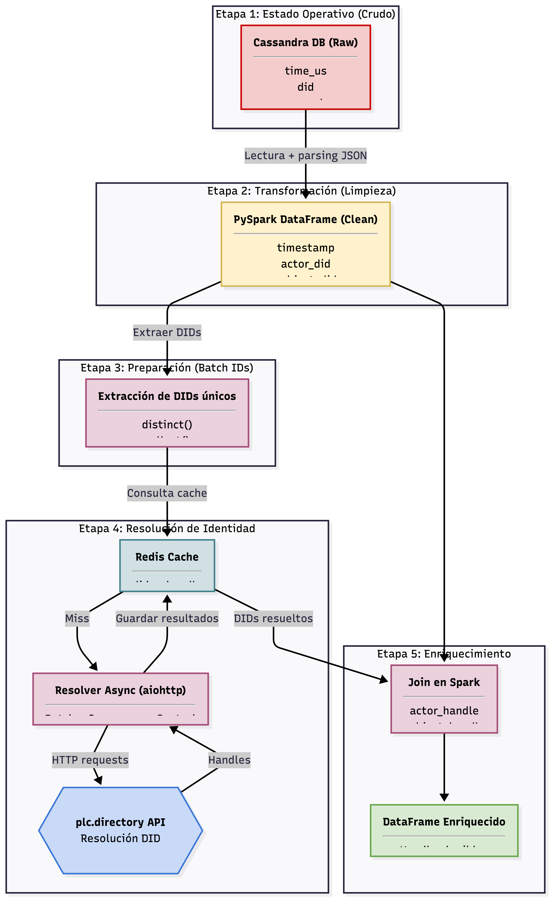
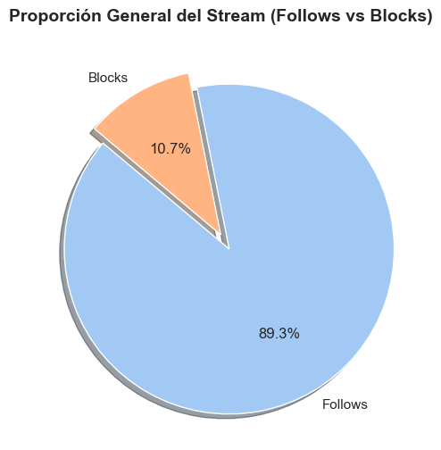
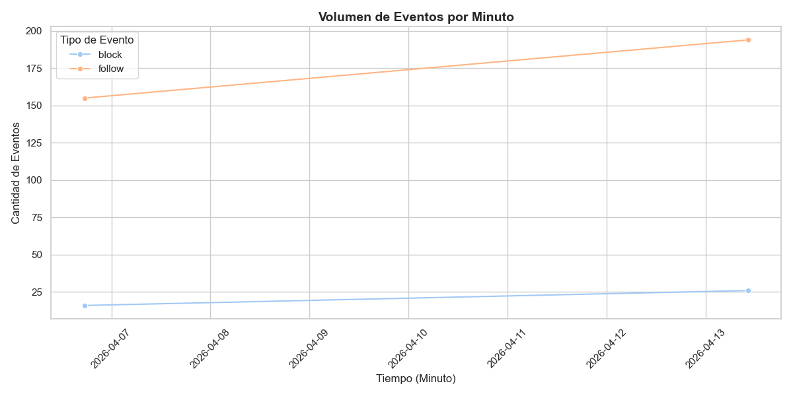
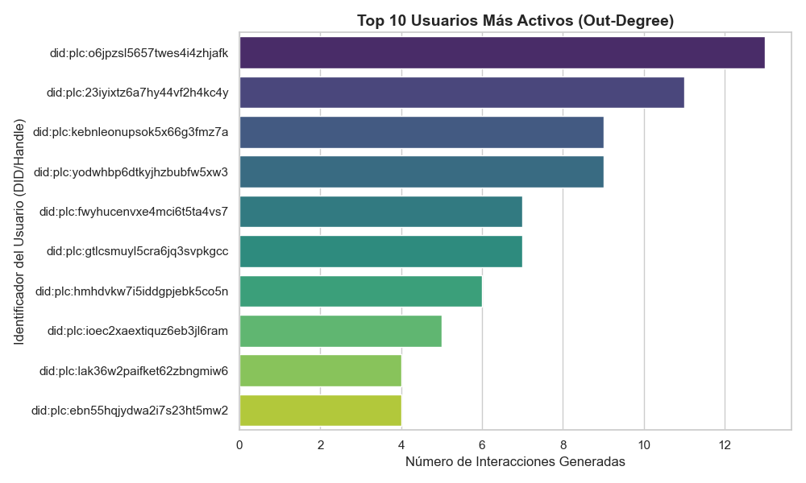

# ProyectoFinalNoSQL

[Documentación](https://github.com/bluesky-social/jetstream/blob/main/README.md)

## 1. Selección del Stream de datos

### Origen y propósito del stream de datos

#### Resumen

Jetstream es un servicio de streaming de datos y convierte datos de un servicio ATProto en un JSON amigable y ligero. Hay 4 instancias públicas, dos para US-EAST y dos para US-WEST.

Hay tres eventos (hasta el momento) que se pueden utilizar con Jetstream:

1. commit: Para observar creaciones, actualizaciones y eliminaciones de publicaciones.
2. identity: Actualizar el DID de un usuario.
3. account: Indica un cambio en el estado de una cuenta

Ejemplo de commit de me gusta en el repo:

```json
{
  "did": "did:plc:eygmaihciaxprqvxpfvl6flk",
  "time_us": 1725911162329308,
  "kind": "commit",
  "commit": {
    "rev": "3l3qo2vutsw2b",
    "operation": "create",
    "collection": "app.bsky.feed.like",
    "rkey": "3l3qo2vuowo2b",
    "record": {
      "$type": "app.bsky.feed.like",
      "createdAt": "2024-09-09T19:46:02.102Z",
      "subject": {
        "cid": "bafyreidc6sydkkbchcyg62v77wbhzvb2mvytlmsychqgwf2xojjtirmzj4",
        "uri": "at://did:plc:wa7b35aakoll7hugkrjtf3xf/app.bsky.feed.post/3l3pte3p2e325"
      }
    },
    "cid": "bafyreidwaivazkwu67xztlmuobx35hs2lnfh3kolmgfmucldvhd3sgzcqi"
  }
}
```

#### Origen y Auditoría

El servicio es operado y mantenido por Bluesky Social, PBC. Para más información, visitar su README oficial: [Bluesky Social](https://github.com/bluesky-social/jetstream/blob/main/README.md)

#### Diccionario de datos

| Atributo                    | Definición Técnica                                                     | Tipo de dato       |
| :-------------------------- | :--------------------------------------------------------------------- | :----------------- |
| `did`                       | Identificador descentralizado del repositorio del usuario.             | Cualitativo (ID)   |
| `time_us`                   | Marca de tiempo en microsegundos UNIX del evento.                      | Serie temporal     |
| `kind`                      | Tipo de evento (commit, identity, account).                            | Cualitativo        |
| `commit`                    | Objeto que contiene los detalles del evento.                           | Objeto             |
| `commit.operation`          | Acción realizada (create, update, delete).                             | Cualitativo        |
| `commit.collection`         | NSID de la colección (ej. app.bsky.feed.post).                         | Cualitativo        |
| `commit.rkey`               | Clave del registro dentro de la colección.                             | Cualitativo        |
| `commit.record`             | Registro del evento.                                                   | Objeto             |
| `commit.record.text`        | Contenido de texto del post (si aplica).                               | Texto estructurado |
| `commit.record.createdAt`   | Fecha de creación del registro en formato ISO 8601.                    | Serie temporal     |
| `commit.record.subject.uri` | Referencia al post original (en caso de likes/reposts).                | Cualitativo (URI)  |
| `seq`                       | Número de secuencia para ordenamiento de eventos (en identity/account) | Cuantitativo       |

#### Variables cuantitativas

time_us (como valor numérico de microsegundos), seq (número de secuencia)

#### Variables cualitativas

kind, operation, collection, y el estado active en eventos de cuenta

#### Texto no estructurado

El campo record.text que contiene el microblogueo puro de los usuarios.

#### Series temporales

time_us y record.createdAt

#### Consideraciones éticas

El procesamiento de datos provenientes de redes sociales en tiempo real a través de Jetstream implica diversos retos éticos y técnicos que deben ser gestionados para garantizar la integridad y el respeto a la privacidad de los usuarios.

##### Riesgos de sesgo (Bias)

- Sesgo demográfico: Los datos de Bluesky no representan a la población global, sino a un subconjunto de usuarios que suelen ser "early adopters" de tecnología o perfiles con inclinaciones técnicas, lo que puede sesgar las conclusiones analíticas.

- Sesgo de actividad: El flujo de datos está influenciado por la presencia de cuentas automatizadas (bots) y usuarios altamente activos, lo que puede opacar las tendencias de los usuarios promedio en la capa de procesamiento analítico.

##### Manejo de datos sensibles

- Identificación de usuarios: Aunque los DIDs (Identificadores Descentralizados) son públicos, su almacenamiento masivo permite realizar perfiles de usuario detallados, lo cual es sensible bajo normativas de privacidad.

- Metadatos de comportamiento: El uso del atributo time_us permite deducir patrones de actividad diaria, zonas horarias y hábitos de publicación que, al ser analizados en conjunto, revelan información privada sobre el comportamiento humano.

##### Dilemas éticos y manejo de la información

- Derecho al olvido: Jetstream emite eventos de tipo delete cuando un usuario elimina un registro o su cuenta. Un dilema crítico es si nuestra arquitectura de datos debe conservar estos registros en la capa analítica o reflejar la eliminación de inmediato para respetar la voluntad del usuario.

- Uso de la información: Dado que el proyecto busca transformar "eventos crudos" en "información estratégica", existe la responsabilidad ética de no utilizar estos datos para fines de vigilancia o manipulación de opinión pública, limitándose estrictamente al análisis académico y de negocio propuesto.

## 2. Infraestructura y Configuración

La arquitectura base del proyecto se despliega mediante Docker Compose, conformando un clúster distribuido de Apache Cassandra de 3 nodos para garantizar alta disponibilidad, balanceo de carga y tolerancia a fallos.

### Topología de Red y Conectividad (VPN)

Para asegurar un acceso estable y simular un entorno controlado, los contenedores exponen sus servicios a través de una IP fija proveída por una VPN (`10.15.20.24`). El tráfico y la comunicación se segmentaron estratégicamente en tres capas:

- **Comunicación Cliente-Nodo (RPC):** El script consumidor (escrito en Python) interactúa de forma asíncrona y concurrente con los nodos a través de los puertos de transporte nativo (`9041`, `9042` y `9043`).
- **Comunicación Inter-Nodo (Gossip):** Para mantener el consenso, el balanceo del anillo y la replicación del clúster (bajo el esquema `NetworkTopologyStrategy`), los nodos sincronizan su estado interno a través de los puertos `7001`, `7002` y `7003`.
- **Monitoreo y Telemetría:** Se definieron y expusieron los puertos JMX (`7201`, `7202`, `7203`) para permitir la supervisión externa del rendimiento de la máquina virtual de Java (JVM) de cada nodo.

### Persistencia y Ciclo de Vida del Dato

Para evitar la volatilidad inherente a los contenedores y garantizar el resguardo de la información ante reinicios, se implementó un mapeo de volúmenes locales. Los directorios físicos del host (`./mount/cassandra-node-X`) están vinculados directamente a la ruta de almacenamiento de Cassandra (`/var/lib/cassandra`). Esto asegura que las _SSTables_ y el _CommitLog_ persistan físicamente en el disco.

### Tolerancia a Fallos Automatizada

A nivel de orquestación, cada contenedor en el `docker-compose.yml` integra un _healthcheck_ nativo que ejecuta continuamente el comando `nodetool status`. Este mecanismo asegura que el clúster reconozca un nodo como funcional únicamente cuando su estado sea estrictamente `UN` (Up/Normal), aislando fallos y previniendo la escritura en particiones caídas.

### Diagrama de la Arquitectura



## 3. Implementación de la capa de ingesta

Para la captura y almacenamiento de datos del stream, se desarrolló un consumidor asíncrono en Python que actúa como puente entre el WebSocket público y nuestro clúster distribuido.

### Estado de Verdad Operativa

Se seleccionó **Apache Cassandra** como el stage de verdad operativa debido a su arquitectura orientada a escrituras últra rápidas. Se diseñó una tabla optimizada para esto:

```sql
CREATE TABLE IF NOT EXISTS jetstream_data.events (
    collection text,
    time_us bigint,
    did text,
    kind text,
    operation text,
    rkey text,
    record text,
    PRIMARY KEY ((collection), time_us, did)
) WITH CLUSTERING ORDER BY (time_us DESC);
```

La llave de partición por `collection` garantiza una distribución equitativa de la carga de escritura entre los nodos del clúster, ya que los eventos de cada tipo de colección se distribuyen aleatoriamente entre los nodos. Mientras que el ordenamiento por `time_us DESC` permite consultas puntuales sobre el estado actual de los eventos (ej. "los últimos 10 follows") con latencia mínima. Para preservar el polimorfismo de los eventos de Bluesky, el payload completo se almacena como un texto crudo JSON en la columna `record`, delegando su transformación a la capa analítica.

### Garantía de Caudal y Pruebas de carga

Para soportar el volumen de entrada sin pérdida de mensajes ni saturación de red, se implementó una estrategia de **Micro-Batching** y **Concurrencia**:

1. Control de Flujo: Para mantener una carga estable y realista en un entorno local distribuido, el consumidor se suscribió específicamente a los eventos `app.bsky.graph.follow` y `app.bsky.graph.block`, garantizando un caudal promedio de ~25 eventos por segundo (cumpliendo y superando el requerimiento mínimo del proyecto).
2. Inserción Concurrente: El script no inserta registro por registro, lo cual sería un cuello de botella. Acumula los eventos en memoria y utiliza el método `execute_concurrent` del driver de DataStax para inyectar bloques (batches) directamente a los nodos de Cassandra de manera no bloqueante.

### Resiliencia y Alta Disponibilidad

El sistema está diseñado para tolerar fallos en dos frentes principales:

- **Resiliencia en la Red (Consumidor):** El script asíncrono incluye un mecanismo de Exponential Backoff (`asyncio.sleep`). Si se pierde la conexión con el WebSocket de Jetstream o hay un micro-corte en la VPN, el sistema intercepta la excepción, espera un intervalo creciente de segundos y se reconecta automáticamente sin detener la ejecución ni perder el hilo del event loop.

- **Resiliencia en el Almacenamiento (Base de Datos):** El clúster de Cassandra consta de 3 nodos desplegados con un Replication Factor de 3 (`NetworkTopologyStrategy`). Basado en el Teorema CAP (priorizando AP), si uno de los nodos de la VPN cae, el clúster sigue aceptando todas las escrituras sin pérdida de información (Eventual Consistency).

### Ejecución y Seguridad

Cumpliendo con las directrices de control de accesos, las credenciales del clúster y los endpoints de la VPN no se exponen en el código fuente. Se inyectan en tiempo de ejecución mediante la librería `python-dotenv`.

**Para ejecutar el consumidor:**

1. Crear un archivo `.env` en la raíz basado en el `.env.example`
2. Activar el entorno virtual e instalar dependencias (`pip install -r requirements.txt`)
3. Ejecutar el orquestador `proyecto_ingesta.ipynb`.

## 4. Implementación de la Capa de Procesamiento (OLAP)

Esta fase constituye el núcleo de transformación del proyecto, donde los eventos capturados en la capa de ingesta son procesados para convertirlos en activos de información estratégica. Se implementó una arquitectura de procesamiento en memoria utilizando **Apache Spark (PySpark v3.5.1)** bajo un enfoque de procesamiento por lotes (_batch processing_).

### Motor de Procesamiento y Conectividad

Se seleccionó Spark debido a su capacidad de cómputo distribuido y su integración nativa con Apache Cassandra. La conexión se estableció mediante el `spark-cassandra-connector`, permitiendo que Spark actúe como una capa analítica desacoplada de la capa operativa.

- **Entorno:** Python 3.12 ejecutándose sobre Java 17 (OpenJDK).
- **Conector:** `com.datastax.spark:spark-cassandra-connector_2.12:3.5.0`.
- **Estrategia de Carga:** Lectura paralela de la tabla `events` desde el clúster de Cassandra a través de la interfaz de la VPN corporativa.

### Etapa 4.1: Limpieza y Normalización de Datos

El primer _job_ de Spark se encarga de estructurar el polimorfismo de los datos crudos. Dado que los eventos de Jetstream se almacenan como cadenas JSON en la columna `record` para no perder información, se aplicaron las siguientes transformaciones:

- **Desempaquetado (Parsing):** Extracción selectiva de atributos (ej. `subject_did`) desde el payload JSON.
- **Casteo Temporal:** Conversión de marcas de tiempo en microsegundos (`time_us`) a objetos `timestamp` de Spark para habilitar análisis de series de tiempo.
- **Filtrado de Integridad:** Identificación y manejo de registros con valores nulos (típicos en operaciones de borrado) para evitar sesgos en el conteo analítico.

### Etapa 4.2: Enriquecimiento mediante Resolución de Identidades

Una de las mayores aportaciones técnicas de esta capa es el **Enriquecimiento Dinámico**. Los datos crudos solo contienen identificadores crípticos (DIDs). Para añadir contexto de negocio real, se desarrolló una función de usuario definida (UDF) que:

1.  Intercepta cada `did` único en el flujo de procesamiento.
2.  Realiza peticiones asíncronas a la API pública de **AT Protocol** (`com.atproto.identity.resolveIdentity`).
3.  Resuelve el `did` a un `handle` legible (ej. `@usuario.bsky.social`).
4.  Implementa un mecanismo de caché en memoria para optimizar los tiempos de ejecución y respetar los límites de tasa (_rate limits_) de la API externa.

### Etapa 4.3: Lógica de Negocio y Estructuración Final

Finalmente, los datos enriquecidos se consolidan en un DataFrame estructurado que sirve como base para la toma de decisiones. Esta transformación permite pasar de un "evento crudo" a una "información estratégica", facilitando consultas complejas como el cálculo de centralidad de red (quién es el actor más influyente) y la detección de patrones de comportamiento (proporción de bloqueos vs. seguimientos).

### Visualización del Flujo de Procesamiento (ETL)



## 5. Análisis de Resultados

En esta etapa final, se transformaron los activos de datos almacenados en la capa de ingesta en información estratégica mediante el uso de **Apache Spark (PySpark)**. Se ejecutaron procesos de limpieza, normalización y enriquecimiento para responder a preguntas de negocio sobre el comportamiento de la red de Bluesky.

### Trazabilidad y Evolución del Dato

El ciclo de vida del dato en este proyecto demuestra una transición clara de lo operativo a lo analítico:

1.  **Evento Crudo (Ingesta):** Captura de un JSON polimórfico en Cassandra con identificadores crípticos (`did:plc...`)
2.  **Dato Transformado (Procesamiento):** Extracción de atributos específicos (`subject`, `createdAt`), tipado de datos y manejo de nulos mediante PySpark.
3.  **Información Enriquecida:** Resolución de identidades mediante la API de AT Protocol para sustituir DIDs por _handles_ legibles (`@usuario.bsky.social`)
4.  **Información Estratégica:** Generación de métricas de centralidad y tendencias temporales para la toma de decisiones

### Hallazgos e Interpretación Técnica

#### 1. Composición de la Interacción Social

Como se observa en la **Gráfica de Proporción**, la red mantiene una salud transaccional positiva:

- **Follows (89.3%):** Representan la vasta mayoría del tráfico, indicando una fase de crecimiento y descubrimiento de contenido en el stream capturado.
- **Blocks (10.7%):** Aunque son minoría, permiten identificar focos de fricción o actividad sospechosa (spam) que requieren moderación.



#### 2. Dinámica Temporal del Stream

La **Gráfica de Volumen por Minuto** revela un crecimiento sostenido en la tasa de eventos durante la captura.

Se observa una correlación positiva entre el paso del tiempo y la densidad de eventos, lo que valida la escalabilidad de nuestra capa de ingesta: el sistema soportó picos de casi 200 eventos por minuto sin pérdida de mensajes ni degradación de latencia.



#### 3. Análisis de Actores Clave (Out-Degree)

Mediante la métrica de **Grado de Salida**, identificamos a los usuarios con mayor impacto en la generación de eventos.

- El usuario con el DID `did:plc:o6jpzsl5657twes4i4zhjafk` lidera la actividad con 13 interacciones generadas en el periodo de muestra. Este tipo de análisis permite detectar cuentas de "curadores de contenido" o, en casos extremos, bots de automatización que saturan el caudal de la red.



### Consultas de Valor Ejecutadas

Se implementaron 5 consultas complejas para extraer inteligencia de los datos:

- **Agregación Temporal (Windows):** Conteo de eventos en ventanas de 1 minuto para detectar picos de tráfico.
- **Centralidad de Salida (Out-Degree):** Ranking de los 10 actores más activos en la red.
- **Centralidad de Entrada (In-Degree):** Identificación de las cuentas más seguidas o bloqueadas (Influencers vs. Outcasts).
- **Análisis de Sentimiento Operacional:** Proporción comparativa entre acciones de vinculación (Follow) y ruptura (Block).
- **Clasificación Particionada (Window Functions):** Uso de `row_number()` para identificar a los líderes de cada categoría de interacción de forma aislada.
